# OOXML Explorer: Repository Architecture & Knowledge Graph

This document serves as the official architectural source of truth for the **OOXML Explorer** repository. It contains the project's Knowledge Graph, structural overview, data flows, and details about the automated invariant checks that safeguard the codebase.

---

## 1. Project Knowledge Graph

The following Mermaid diagram visualizes the high-fidelity dependency structure, module organization, and runtime data flow of the OOXML Explorer.

```mermaid
graph TD
    %% Styling and classes
    classDef view fill:#1E3A8A,stroke:#3B82F6,stroke-width:2px,color:#FFFFFF;
    classDef component fill:#0F766E,stroke:#0D9488,stroke-width:2px,color:#FFFFFF;
    classDef store fill:#701A75,stroke:#D946EF,stroke-width:2px,color:#FFFFFF;
    classDef service fill:#B45309,stroke:#F59E0B,stroke-width:2px,color:#FFFFFF;
    classDef util fill:#374151,stroke:#6B7280,stroke-width:2px,color:#FFFFFF;
    classDef test fill:#991B1B,stroke:#EF4444,stroke-width:2px,color:#FFFFFF;

    %% Subgraphs for Layering
    subgraph Views ["1. Presentation Views (Screens)"]
        App["App.tsx"]:::view
        LandingView["LandingView.tsx"]:::view
        EditorView["EditorView.tsx"]:::view
        DiffView["DiffView.tsx"]:::view
        ValidatorView["ValidatorView.tsx"]:::view
    end

    subgraph Components ["2. Shared UI Components"]
        FileTree["FileTree.tsx"]:::component
        AIPanel["AIPanel.tsx"]:::component
        ErrorBoundary["ErrorBoundary.tsx"]:::component
        Logo["Logo.tsx"]:::component
    end

    subgraph Store ["3. State Management"]
        AppStore["appStore.ts (Zustand)"]:::store
        Types["types.ts"]:::store
    end

    subgraph Services ["4. Core Services (Business Logic)"]
        ZipService["zipService.ts (JSZip)"]:::service
        GeminiService["geminiService.ts (@google/genai)"]:::service
        TestService["testService.ts (Integrity Checks)"]:::service
        BrowserRunner["browserTestRunner.ts (Test Shim)"]:::service
        DebugService["debugService.ts (Console & Crashes)"]:::service
    end

    subgraph Utils ["5. Shared Utilities"]
        XmlUtils["xmlUtils.ts (Format/Minify)"]:::util
        TreeUtils["treeUtils.ts (Traversal)"]:::util
        DiffUtils["diffUtils.ts (Triggers)"]:::util
        HotkeyUtils["hotkeyUtils.ts (Shortcuts)"]:::util
        ThemeUtils["theme.ts (Monaco & Tailwind HSL)"]:::util
        MdUtils["markdownUtils.ts (Gemini MD Parser)"]:::util
    end

    %% Dependency & Flow Connections
    App --> LandingView
    App --> EditorView
    App --> DiffView
    App --> ValidatorView
    App --> ErrorBoundary

    %% View Interactions with Store
    LandingView -.->|Triggers| AppStore
    EditorView -.->|Triggers / Reads| AppStore
    DiffView -.->|Triggers / Reads| AppStore
    ValidatorView -.->|Triggers / Reads| AppStore

    %% View Component Usage
    EditorView --> FileTree
    EditorView --> AIPanel
    EditorView --> ErrorBoundary
    DiffView --> FileTree
    DiffView --> AIPanel
    DiffView --> ErrorBoundary
    LandingView --> Logo
    EditorView --> Logo
    DiffView --> Logo

    %% Component Internal Connections
    AIPanel --> MdUtils
    AIPanel --> GeminiService

    %% Store to Service Calls
    AppStore --> ZipService
    
    %% Service Dependencies
    ZipService --> Types
    TestService --> ZipService
    TestService --> BrowserRunner
    ValidatorView --> TestService
    ValidatorView --> DebugService
    
    %% Utilities Usage
    EditorView --> XmlUtils
    EditorView --> HotkeyUtils
    EditorView --> ThemeUtils
    DiffView --> XmlUtils
    DiffView --> TreeUtils
    DiffView --> DiffUtils
    DiffView --> ThemeUtils
    ValidatorView --> ThemeUtils
    ZipService --> XmlUtils
```

---

## 2. Core Architectural Layers

### A. Presentation Views (views/)
* **App.tsx**: The central router. Loads views (`landing`, `editor`, `diff-view`, `validator`) based on Zustand store state.
* **LandingView.tsx**: Premium entrypoint. Handles drag-and-drop file inputs. Channels 1 file to the editor and 2+ files to the diff comparison view.
* **EditorView.tsx**: Main editing interface. Hooks up the collapsible sidebar `FileTree`, a multi-tab editor view powered by Monaco, and the `AIPanel` helper drawer.
* **DiffView.tsx**: Diff interface. Displays split/inline Monaco Diff editors, handles next/prev delta navigation, and passes file deltas to the `AIPanel` for explanation.
* **ValidatorView.tsx**: QA dashboard. Runs Vitest unit tests in-browser, performs file-integrity checks, displays coverage indicators, and hosts interactive checklists to verify UI states.

### B. State Management (store/)
* **appStore.ts**: Unified Zustand store. Coordinates:
  1. Global UI states (active theme, displaying view, panel closures).
  2. Editor states (active file ZIP, parsed trees, tabs, pending/dirty changes).
  3. Diff states (original/modified files, original/modified ZIPs, diff trees).

### C. Core Services (services/)
* **zipService.ts**: Compression engine using `JSZip`. Parses archives, creates folder hierarchies, performs CRC-based diff checks, and repacks modifications.
* **geminiService.ts**: AI interaction engine using `@google/genai`. Formulates prompt structures for explaining files, technical reviews, and diff summaries.
* **testService.ts**: Runs browser-based unit tests and functional physical checks (XML reads/writes and dry-run packaging).
* **browserTestRunner.ts**: Core framework shim that allows standard Vitest tests (`describe`, `it`, `expect`, `vi`) to be executed directly inside the browser sandbox.
* **debugService.ts**: Patches console methods to capture runtime execution logs and exports diagnostic packages.

---

## 3. Enforced Codebase Invariants

To guarantee that the application remains robust and compliant with the ECMA-376 specification, we have programmatically locked down key codebase invariants using our automated test harness:

### Invariant A: Strict OOXML ZIP Packing Order & Compression
* **Rule**: When generating an exported OOXML package, the `mimetype` file **MUST** be placed first in the archive, and it **MUST NOT** be compressed (`STORE` mode in JSZip). Subsequent XML assets **MUST** be compressed using `DEFLATE`.
* **Validation**: Verified functionally in [tests/zipInvariants.test.ts](file:///Users/adbindal/code/exp/ooxml-explorer/tests/zipInvariants.test.ts).

### Invariant B: Monaco Word Wrap Compliance
* **Rule**: All Monaco Editor and Diff Editor instances must enable word wrapping (`wordWrap: 'on'`) to guarantee readable viewports on smaller screens.
* **Validation**: Verified statically in [tests/staticInvariants.test.ts](file:///Users/adbindal/code/exp/ooxml-explorer/tests/staticInvariants.test.ts).

### Invariant C: Theme compliance (No raw tailwind colors)
* **Rule**: Views and components must use dynamic, theme-aware HSL style classes generated by `useThemeClasses` rather than hardcoding static Tailwind classes (like `bg-red-500` or `text-blue-600`), ensuring full dark/light mode compatibility.
* **Validation**: Verified statically in [tests/staticInvariants.test.ts](file:///Users/adbindal/code/exp/ooxml-explorer/tests/staticInvariants.test.ts) (excluding whitelisted layout files).

### Invariant D: No Local State Duplication
* **Rule**: Components must not manage local duplicate states for variables that require global synchronization (such as `activePath` or `sidebarOpen`). All shared parameters must be routed through the Zustand store.
* **Validation**: Verified statically in [tests/staticInvariants.test.ts](file:///Users/adbindal/code/exp/ooxml-explorer/tests/staticInvariants.test.ts).
