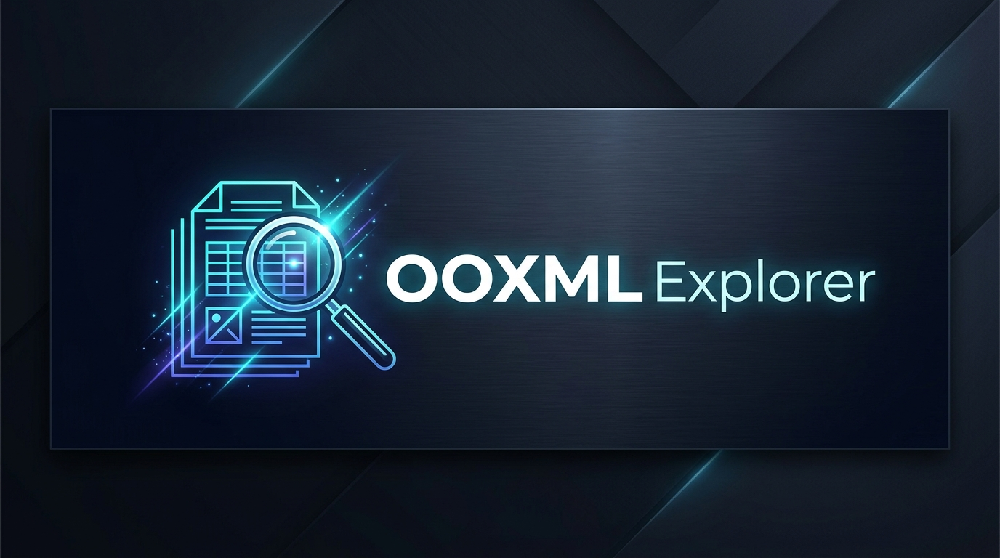
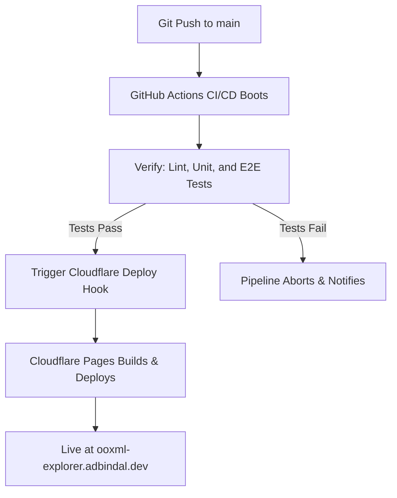

<div align="center">


# 🔍 OOXML Explorer

[](https://github.com/adbindal/ooxml-explorer/actions/workflows/quality-gates.yml)
[](https://ooxml-explorer.adbindal.dev)
[](https://nodejs.org)
[](LICENSE)

**OOXML Explorer** is a premium, high-performance, dark-mode first web application designed to inspect, edit, compare, and audit Office Open XML (OOXML) documents (`.docx`, `.xlsx`, `.pptx`) directly inside the web browser. Built on a modern React, TypeScript, and Zustand stack, it features integrations with Monaco Editor, JSZip, and Google Gemini AI.

[**Launch OOXML Explorer Live**](https://ooxml-explorer.adbindal.dev)

</div>

---

## ✨ Key Features

*   **📂 Real-Time ZIP Inspection**: Upload any OOXML archive and instantly traverse its internal directory structure, XML assets, and media files without server-side processing.
*   **📝 Monaco Editor Integration**: Edit XML files natively in the browser with full schema awareness, automatic code formatting, word wrapping, and real-time state synchronization.
*   **📊 Visual Diff Engine**: Perform side-by-side or inline comparisons of two OOXML documents. Detect modifications, additions, and deletions using a robust CRC-checksum-based file tree.
*   **🧪 In-Browser QA Validator**: Run the integrated test suite directly inside the browser using a custom-built, sandboxed unit test runner, complete with a scrollable real-time logs console.
*   **🤖 Gemini AI Assistant**: Explain changes between files, audit document structures for compliance, and rewrite XML nodes using Google Gemini AI.
*   **🛡️ Self-Healing Repacker**: Automatically complies with strict OOXML specifications by placing the uncompressed `mimetype` file first in the ZIP archive and compressing subsequent XML assets using `DEFLATE` to prevent Microsoft Office corruption errors.

---

## 🏗️ Project Architecture

```
ooxml-explorer/
├── .github/workflows/   # CI/CD pipelines (GitHub Actions Quality Gates)
├── components/          # Reusable UI widgets (FileTree, AIPanel, Logo, ConsolePane)
├── services/            # Business engines (zipService, geminiService, testService)
├── store/               # Unified State Management (Zustand: appStore.ts)
├── views/               # Page-level route views (Landing, Editor, Diff, Validator)
├── utils/               # Formatter, trees, hotkeys, themes, and markdown shims
├── tests/               # Unit, integration, security, and Playwright E2E tests
├── wrangler.jsonc       # Cloudflare Pages deployment configuration
└── types.ts             # Global TypeScript type definitions
```

---

## 🚦 CI/CD & Deployment Flow

We use a **secure, orchestrated deployment pipeline** to guarantee that the production site remains 100% stable:



---

## 🚀 Development & Setup

### Prerequisites
*   **Node.js**: `>= 22.0.0` (Required due to Cloudflare Vite plugin ESM loading hooks)
*   **NVM** (Node Version Manager) is recommended.

### Local Development
1.  **Clone the Repository**:
    ```bash
    git clone https://github.com/adbindal/ooxml-explorer.git
    cd ooxml-explorer
    ```
2.  **Install Dependencies**:
    ```bash
    npm install
    ```
3.  **Configure Environment**:
    Create a `.env.local` file in the root directory:
    ```env
    VITE_GEMINI_API_KEY=your_gemini_api_key_here
    ```
4.  **Launch Dev Server**:
    ```bash
    npm run dev
    ```
    Open [http://localhost:3000](http://localhost:3000) in your browser.

---

## 🧪 Testing Suite

We maintain a comprehensive testing suite consisting of **87 unit/integration tests** and **3 browser automation E2E suites**.

### 1. Run Quality Checks Locally
Run static analysis and unit tests programmatically on your terminal:
```bash
# Run ESLint check
npm run lint

# Run Vitest unit & integration tests
npm run test

# Run test coverage
npm run test:coverage
```

### 2. Run End-to-End (E2E) Browser Tests
Automate real browser user flows (Editor, Diff View, and live Validator upload/run cycle) using Playwright:
```bash
# Install Playwright browser engines (first-time setup)
npx playwright install --with-deps chromium

# Run all E2E tests headlessly
npx playwright test
```

---

## 🔒 Security & Resilience Invariants

*   **API Key Scrubbing**: The debug logger ([`services/debugService.ts`](file:///Users/adbindal/code/exp/ooxml-explorer/services/debugService.ts)) intercepts and scrubs the Gemini API key, replacing it with `[SCRUBBED_API_KEY]` to prevent secrets from leaking into debug dumps and console outputs.
*   **Path Traversal Prevention**: The ZIP extraction engine ([`services/zipService.ts`](file:///Users/adbindal/code/exp/ooxml-explorer/services/zipService.ts)) automatically sanitizes and discards any ZIP entries containing path traversal sequences (like `../` or `..\`) to protect against Zip Slip vulnerabilities.
*   **Test Isolation**: Tests utilize isolated Zustand stores created via `create(appStoreCreator)` rather than the live application store. This prevents test execution from mutating the active UI state and unmounting the browser test runner.

---

## 📄 License

This project is licensed under the MIT License. See [LICENSE](LICENSE) for details.
