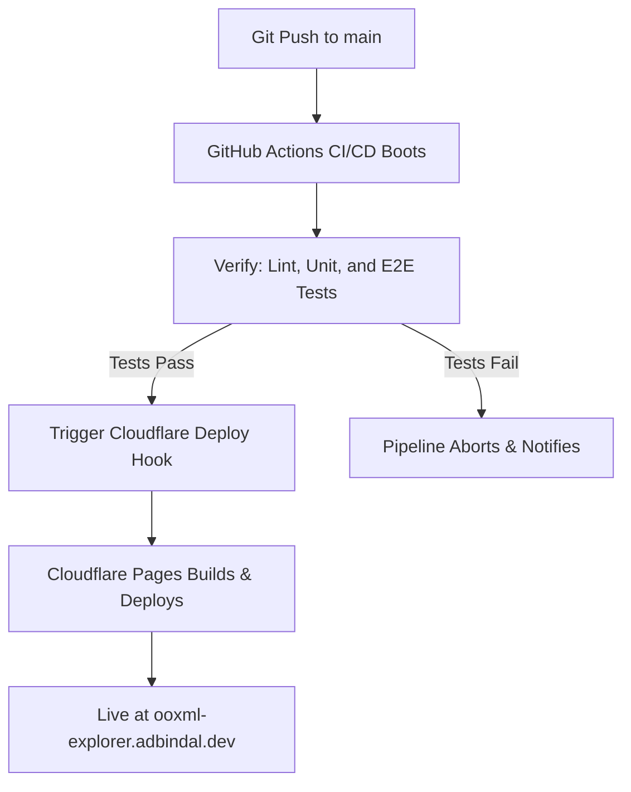

<div align="center">


# 🔍 OOXML Explorer

[](https://github.com/adbindal/ooxml-explorer/actions/workflows/quality-gates.yml)
[](https://ooxml-explorer.adbindal.dev)
[](https://nodejs.org)
[](LICENSE)

**OOXML Explorer** is a premium, high-performance, dark-mode first web application designed to inspect, edit, compare, and audit Office Open XML (OOXML) documents (`.docx`, `.xlsx`, `.pptx`) directly inside the web browser. Built on a modern React, TypeScript, and Zustand stack, it features integrations with Monaco Editor, JSZip, and Google Gemini AI.

[**Launch OOXML Explorer Live**](https://ooxml-explorer.adbindal.dev)

</div>

---

## ✨ Key Features

*   **📂 Real-Time ZIP Inspection**: Upload any OOXML archive and instantly traverse its internal directory structure, XML assets, and media files without server-side processing.
*   **📝 Monaco Editor Integration**: Edit XML files natively in the browser with full schema awareness, automatic code formatting, word wrapping, and real-time state synchronization.
*   **📊 Visual Diff Engine**: Perform side-by-side or inline comparisons of two OOXML documents. Detect modifications, additions, and deletions using a robust CRC-checksum-based file tree.
*   **🧪 In-Browser QA Validator**: Run the integrated test suite directly inside the browser using a custom-built, sandboxed unit test runner, complete with a scrollable real-time logs console.
*   **🔬 Deterministic Analysis Engine**: **22 analyzers** across Word, Excel and PowerPoint, each detecting a fault that *renders correctly and is broken anyway* — a dropped OLE embedding behind an intact preview, a cross-reference to a deleted bookmark still showing its cached text, an equation whose operator was never written down. Every finding is computed in TypeScript, never asserted by a model.
*   **🤖 AI Assistant, grounded**: Explains elements and diffs using Gemini or an on-device model. Answers carry an evidence badge — `Verified` (computed from your file), `Grounded` (backed by a citation) or `Unverified` (the model's own recall) — **computed from provenance in code the model never touches**.
*   **📖 Schema Dictionary**: 2,186 records generated from the Open XML SDK, cross-checked against ECMA-376's own XSDs. Attributes carry their permitted values, not just their names.
*   **🛡️ Self-Healing Repacker**: Automatically complies with strict OOXML specifications by placing the uncompressed `mimetype` file first in the ZIP archive and compressing subsequent XML assets using `DEFLATE` to prevent Microsoft Office corruption errors.

---

## 🏗️ Project Architecture

```
ooxml-explorer/
├── .github/workflows/   # CI/CD pipelines (GitHub Actions Quality Gates)
├── .agents/skills/      # Repeatable procedures: add-analyzer, check-real-files, run-tests
├── components/          # Reusable UI widgets (FileTree, AIPanel, Logo, ConsolePane)
├── docs/                # Design record (RESEARCH-STATE.md) and licensing research
├── scripts/             # Corpus generation, spec extraction, smoke fixtures
├── services/            # The engine: 22 analyzers, findings.ts, analyzers.ts registry
├── store/               # Unified State Management (Zustand: appStore.ts)
├── views/               # Page-level route views (Landing, Editor, Diff, Validator)
├── utils/               # Formatter, trees, hotkeys, themes, and markdown shims
├── tests/               # Unit, integration, security, real-file and Playwright E2E tests
├── public/rag-data.json # Generated schema dictionary — do not hand-edit
├── wrangler.jsonc       # Cloudflare Pages deployment configuration
└── types.ts             # Global TypeScript type definitions
```

---

## 🚦 CI/CD & Deployment Flow

We use a **secure, orchestrated deployment pipeline** to guarantee that the production site remains 100% stable:



---

## 🚀 Development & Setup

### Prerequisites
*   **Node.js**: `>= 22.0.0` (Required due to Cloudflare Vite plugin ESM loading hooks)
*   **pnpm**: this project uses pnpm, and CI installs with `--frozen-lockfile`.
*   **NVM** (Node Version Manager) is recommended.

> ⚠️ **Use `pnpm`, not `npm`, to add or remove a dependency.** `npm install` does not
> update `pnpm-lock.yaml`, so CI fails with `ERR_PNPM_OUTDATED_LOCKFILE` — which is
> exactly how it failed once. Running scripts with `npm run` is harmless; installing is not.

### Local Development
1.  **Clone the Repository**:
    ```bash
    git clone https://github.com/adbindal/ooxml-explorer.git
    cd ooxml-explorer
    ```
2.  **Install Dependencies**:
    ```bash
    pnpm install
    ```
3.  **Configure Environment**:
    Create a `.env.local` file in the root directory:
    ```env
    VITE_GEMINI_API_KEY=your_gemini_api_key_here
    ```
4.  **Launch Dev Server**:
    ```bash
    npm run dev
    ```
    Open [http://localhost:3000](http://localhost:3000) in your browser.

---

## 🧪 Testing Suite

We maintain **1,457 unit and integration tests** across 61 files, plus **7 Playwright E2E
suites**. Every analyzer is also *mutation-tested* — the implementation is deliberately
broken several ways to check the tests actually catch it, which has found a real gap in
nearly every module, most often a test passing for the wrong reason.

### 1. Run Quality Checks Locally
Run static analysis and unit tests programmatically on your terminal:
```bash
# Run ESLint check
npm run lint

# Run Vitest unit & integration tests
npm run test

# Run test coverage
npm run test:coverage
```

### 2. Run End-to-End (E2E) Browser Tests
Automate real browser user flows (Editor, Diff View, and live Validator upload/run cycle) using Playwright:
```bash
# Install Playwright browser engines (first-time setup)
npx playwright install --with-deps chromium

# Run all E2E tests headlessly
npx playwright test
```

### 3. Check against real Office documents

The single highest-yield check in this repo, and the only one that can catch a **false
positive on genuine Office output** — every other test uses XML written by the same person
who wrote the code reading it.

```bash
node scripts/makeSmokeFixtures.mjs   # baseline fixtures, if tests/fixtures/ is empty
npm run test:real
```

Drop your own `.docx`/`.xlsx`/`.pptx` into `tests/fixtures/` first. **The binaries are
gitignored**, so the directory is safe to point at confidential documents. Then follow
[`.agents/skills/check-real-files`](.agents/skills/check-real-files/SKILL.md) to triage what
it reports — the first such run produced 43 findings across three files and *none was a real
fault*, so separating true faults from false alarms is most of the work.

⚠️ CI has no fixtures, so this suite **skips there**. A green pipeline does not mean the
engine has been checked against real files.

### 4. Regenerate the generated data

```bash
npm run ingest:schema   # rebuild public/rag-data.json from the Open XML SDK
npm run spec:facts      # rebuild tests/spec-facts.json from ECMA-376's own XSDs (~8 MB download)
```

`tests/specConformance.test.ts` compares the two and fails on any *new* divergence — and on
a recorded one that has been resolved but not removed, so the list cannot go stale.

---

## 📚 Design Record

[`docs/ooxml-expert-agent/RESEARCH-STATE.md`](docs/ooxml-expert-agent/RESEARCH-STATE.md) is
the durable record: why each analyzer exists, what each one deliberately *cannot* establish,
which approaches were ruled out and on what evidence, and every claim that has been
retracted. **Read §8u before adding an analyzer** (the criterion for what deserves one) and
§8ag before running against real files.

The standing rules there are worth knowing before changing anything:

*   **Deterministic first.** TypeScript decides what is true; the model narrates a
    pre-verified evidence bundle. It never adjudicates correctness.
*   **The evidence badge is computed, never asserted.** Vector databases, re-ranking,
    embeddings on the main path and fine-tuning were each ruled out with reasons recorded.
*   **Mutation-test every module.** A green suite on first run is not evidence.
*   **Say what was not verified.** Five citations have already been retracted here.

---

## 🔒 Security & Resilience Invariants

*   **API Key Scrubbing**: The debug logger ([`services/debugService.ts`](services/debugService.ts)) intercepts and scrubs the Gemini API key, replacing it with `[SCRUBBED_API_KEY]` to prevent secrets from leaking into debug dumps and console outputs.
*   **Path Traversal Prevention**: The ZIP extraction engine ([`services/zipService.ts`](services/zipService.ts)) automatically sanitizes and discards any ZIP entries containing path traversal sequences (like `../` or `..\`) to protect against Zip Slip vulnerabilities.
*   **Test Isolation**: Tests utilize isolated Zustand stores created via `create(appStoreCreator)` rather than the live application store. This prevents test execution from mutating the active UI state and unmounting the browser test runner.

---

## 📄 License

This project is licensed under the MIT License. See [LICENSE](LICENSE) for details.

### Third-party data

Two files in this repository are **generated** from external sources rather than written here,
and are attributed rather than claimed:

| File | Derived from | Terms |
|---|---|---|
| `public/rag-data.json` | [dotnet/Open-XML-SDK](https://github.com/dotnet/Open-XML-SDK) `data/schemas/*.json` | MIT |
| `tests/spec-facts.json` | ECMA-376 Part 4's normative XSDs, published by ECMA as electronic inserts | see below |

Both carry **schema content only** — element names, attribute names, enumerated values,
permitted parents and children. Neither contains specification prose. That distinction is
deliberate: ECMA-376's notice grants distribution of *"any schemas, IDLs, or code samples…
with or without modification"* as a separate and broader permission than the one covering
prose, and the generators were written to stay on the schema side of it.

Regenerate either with `pnpm run ingest:schema` / `pnpm run spec:facts` rather than editing
them. The licensing research behind this is in
[`docs/ooxml-expert-agent/LICENSING.md`](docs/ooxml-expert-agent/LICENSING.md), including what
it deliberately does **not** resolve.
